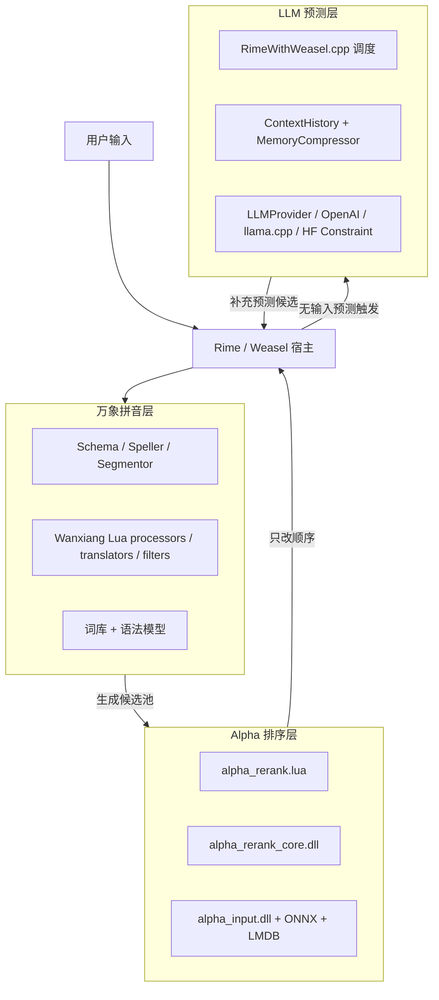

# Wisdom-Weasel 最终架构边界说明

> 依据：
>
> - `third_party/rime_wanxiang/README.md`
> - `third_party/rime_wanxiang/wanxiang.schema.yaml`
> - `third_party/rime_wanxiang/custom/wanxiang_pro.schema.yaml`
> - 当前仓库里的 `RimeWithWeasel/`、`WeaselServer/`、`RimeLuaAlpha/`、`third_party/alpha-input/`

---

## 1. 三个核心资产的最终边界

### A. 万象拼音：**长句/语法/词库/filter 体系**

万象文档的核心定位很明确：

- 它是**基于词库 + 语法模型**的整套 Rime 方案
- 强项是**语句流、长句、分词、语法体验**
- 自带大量 Lua processor / translator / filter，用来增强输入体验

因此它的职责应定义为：

- 负责 **Rime 方案层**
- 负责 **拼音输入主链路**
- 负责 **分词、语法、长句输出**
- 负责 **反查、注释、tips、auto_phrase、super_filter、super_replacer、super_sequence 等方案能力**

它**不是**：

- 你的 LLM 预测系统
- Alpha 模型本体
- 无输入预测的性能责任主体

---

### B. Alpha：**候选排序器 / reranker**

Alpha 的职责应定义为：

- 输入：已有候选池 + 最近上下文
- 输出：**同一批候选的更优顺序**
- 本质是 **ranking / rerank**

它负责：

- 对已有候选做排序优化
- 不改变“候选是怎么生成出来的”这件事

它**不是**：

- 长句生成器
- 语法模型
- 无输入预测器
- 对话式 LLM

---

### C. LLM 预测：**你自己写的预测系统**

这个边界必须单独立住：

- 它是你自己的主功能
- 负责 **无输入预测**
- 负责 **上下文预测补全**
- 负责 **OpenAI / llama.cpp / HF Constraint** 等 provider 调度

它**不是**：

- 万象的一部分
- Alpha 的一部分

---

## 2. 最终分层图



---

## 3. 两条主链路

### 链路一：有拼音输入

最终定义：

1. **万象** 负责生成候选池
2. **Alpha** 负责候选重排
3. **LLM** 不再承担“主排序器”角色

即：

```text
拼音输入
-> 万象词库 / 语法 / Lua 体系生成候选
-> Alpha 对候选重排
-> UI 显示
```

这条链路里：

- 长句能力归 **万象**
- 排序能力归 **Alpha**

---

### 链路二：无输入预测

最终定义：

1. 从 `ContextHistory` 取最近上下文
2. 进入 `RimeWithWeasel::_TriggerLLMPrediction(NoInputPrediction)`
3. 由 `m_llm_provider` 调用具体 provider
4. 返回补充候选并更新 UI

即：

```text
最近上下文
-> 你的 LLM 预测调度器
-> OpenAI / llama.cpp / HF Constraint
-> 返回预测候选
-> UI 显示
```

这条链路里：

- 与万象无关
- 与 Alpha 无关

---

## 4. “无提示预测变慢” 应归谁负责

你提到的：

> 无提示预测似乎可以更快，但某次修改后变慢了

按最终边界，这个问题应优先归到：

- `RimeWithWeasel/RimeWithWeasel.cpp`
- `WeaselServer/LLMProvider.cpp`
- `WeaselServer/LlamaCppProvider.cpp`
- `WeaselServer/HFConstraintProvider.cpp`
- `WeaselServer/ContextHistory.*`

而**不应先怀疑**：

- `third_party/rime_wanxiang/**`
- `alpha_input`
- `alpha_rerank.lua`

原因：

- 无输入预测走的是 **LLMRequestType::NoInputPrediction**
- 该路径使用的是 `m_llm_provider`
- 当前有拼音重排走的是另一条链：`alpha_rerank`

所以性能定位规则应是：

### 如果慢的是：

- **无输入预测慢** → 查 **LLM 预测层**
- **拼音候选排序慢** → 查 **Alpha 排序层**
- **长句/分词/语法不对** → 查 **万象拼音层**

---

## 5. 代码归属最终版

### 5.1 万象拼音层

**目录**

- `third_party/rime_wanxiang/**`

**归属**

- 第三方方案资产
- 以“上游同步 + 轻量 patch”为主

**负责**

- schema
- 词库
- 语法模型
- 方案内 Lua 处理链

**不负责**

- 你的 LLM 预测业务逻辑
- Alpha 模型本体

---

### 5.2 Alpha 排序层

**目录**

- `third_party/alpha-input/**`
- `RimeLuaAlpha/**`
- `third_party/rime_wanxiang/lua/wanxiang/alpha_rerank.lua`

**归属**

- `third_party/alpha-input/**`：第三方 / 模型核心
- `RimeLuaAlpha/**`：我们自己的适配层
- `alpha_rerank.lua`：我们在 Rime 侧接入 Alpha 的 filter

**负责**

- 候选重排
- 本地 ONNX / LMDB 相似度计算

**不负责**

- 长句生成
- LLM 无输入预测

---

### 5.3 LLM 预测层

**目录**

- `RimeWithWeasel/**`
- `WeaselServer/LLMProvider.*`
- `WeaselServer/LlamaCppProvider.cpp`
- `WeaselServer/HFConstraintProvider.cpp`
- `WeaselServer/ContextHistory.*`
- `WeaselServer/MemoryCompressor.*`

**归属**

- 这是你自己的主业务代码

**负责**

- 无输入预测
- provider 路由
- UI 更新与时序控制
- 上下文历史与记忆压缩

**不负责**

- 万象词库与语法模型
- Alpha 候选排序模型本体

---

### 5.4 包装 / 部署层

**目录**

- `scripts/Install-RimeWanxiang.ps1`
- `docs/*.md`
- `README.md`

**负责**

- 安装说明
- 运行时复制
- 架构边界文档

---

## 6. 后续开发的约束建议

为了避免以后再混，建议遵守下面三条：

### 规则 1

**不要把“长句问题”改到 Alpha 里。**

长句、分词、语法问题优先看万象。

### 规则 2

**不要把“无输入预测问题”改到万象里。**

无输入预测属于你自己的 LLM 系统。

### 规则 3

**Alpha 只做排序，不做生成。**

一旦 Alpha 开始承担补全/生成，就会重新把职责搅混。

---

## 7. 一句话最终定义

### 最终版边界

- **万象拼音** = 词库 + 语法模型 + Rime 方案/filter 体系
- **Alpha** = 候选排序器
- **LLM预测** = 你自己的预测系统

### 最终版数据流

- **有拼音**：万象生成，Alpha排序
- **无输入**：LLM预测直接补充

### 最终版性能归因

- **无输入预测变慢**：先查 LLM 预测层
- **候选排序变慢**：查 Alpha
- **长句/语法体验变化**：查万象

