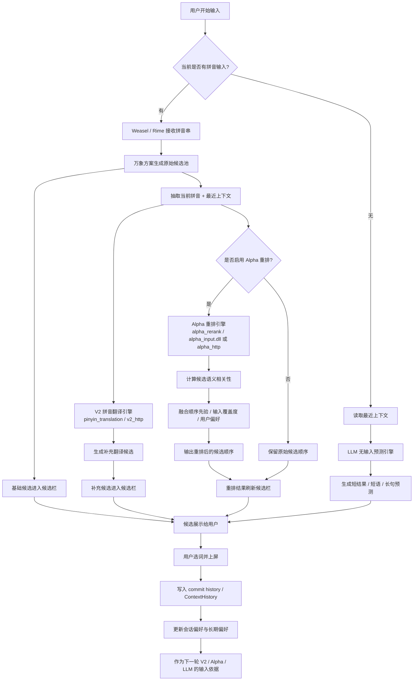

# 参赛说明

> **项目名称：** Wisdom-Weasel：基于上下文感知候选重排与联想预测的智能中文输入法  
> **项目主张：** 让输入法从“拼音转文字工具”升级为“理解意图的表达协同系统”  
> **一句话亮点：** 我们不是在优化一个词库，而是在重构“人和输入法之间的交互逻辑”。

---

## 一、项目概述

传统中文输入法的核心逻辑，本质上仍然是“**编码匹配 + 静态排序**”。

用户输入拼音，系统给出候选；候选排序主要依赖词频、规则、局部调频。这个范式在过去解决了“能不能打出来”的问题，但并没有真正解决“**能不能快速、准确、顺着人的思路打出来**”的问题。

Wisdom-Weasel 的目标，不是做一个“更大的词库”，也不是做一个“套壳式 AI 输入法”，而是提出一种新的输入法逻辑：

> **输入法不应只看当前拼音，还应理解当前语境、用户意图和表达方向。**

因此，项目构建了三层能力：
- **候选生成层**：保留 Rime / 万象成熟的拼音输入和候选生成能力
- **候选重排层**：在有拼音输入时，利用上下文语义对候选池进行实时重排
- **表达预测层**：在无拼音输入时，根据最近语境进行短语/短句联想预测

这个结构使输入法从“被动响应用户按键”，变为“主动理解用户表达”。

---

## 二、为什么这个项目有“颠覆感”

### 1. 颠覆点不是外观，而是底层交互范式
传统输入法解决的是：
- 你输什么拼音，我给什么候选

Wisdom-Weasel 想解决的是：
- 你现在在写什么，我帮你把真正想说的内容提前排出来

这意味着输入法从“字符输入工具”向“表达理解系统”转变。

### 2. 颠覆点不是把 AI 硬塞进输入法，而是重构职责边界
本项目不是简单地把大模型接到输入法后面，而是明确拆成三层：
- **万象/Rime** 负责生成候选
- **Alpha** 负责理解上下文并实时重排
- **LLM** 负责无拼音场景下的联想补全

这使得系统从“混杂式增强”变成“结构化智能输入法架构”。

### 3. 颠覆点是把“输入”升级为“表达协作”
用户真正需要的不是更快地敲拼音，而是更低成本地完成表达。  
因此，项目把输入法的目标从“打字”升级为“写作辅助”。

### 4. 颠覆点是让输入法具备持续记忆能力
用户的上屏行为，不再只是结果，而是未来排序的反馈信号。  
输入法不再是冷冰冰的工具，而开始形成对用户表达偏好的持续适应能力。

---

## 三、问题定义：传统输入法的核心痛点

### 1. 候选排序不够准确
- 同音词多，用户需要频繁选词
- 候选常常“能打出来，但不是最想要的那个”
- 翻页、选词、回看会显著打断思路

### 2. 系统几乎不理解上下文
- 同一组拼音，在不同语境中应该对应完全不同的候选优先级
- 传统输入法更多依赖静态词频，无法真正理解“我现在在写什么”

### 3. 专业/场景化表达命中率不高
- 学习场景：真题、复习
- 办公场景：变更日志、主持词
- 技术场景：重排延迟、缓存优化
- 真实高价值表达，未必恰好是全局高频表达

### 4. 个性化能力弱
- 用户近期常写什么，系统难以快速学会
- 个人表达习惯和当前任务上下文缺乏持续建模

### 5. 输入法止步于“选词”，没有进入“表达辅助”
- 当用户暂停输入拼音时，系统无法有效帮助用户继续组织内容
- 输入法仍然停留在“字符转换”，没有进入“语义协作”阶段

---

## 四、解决方案：把输入法拆成三层智能能力

## 4.1 有拼音输入：上下文感知候选重排
流程如下：
1. 用户输入拼音
2. Rime / 万象生成候选池
3. 系统提取最近上下文
4. Alpha 模块基于语义相关性对候选池实时重排
5. 将更符合当前表达场景的候选提前呈现

这个机制并不推翻原输入法，而是在其上增加“智能排序层”。

## 4.2 无拼音输入：联想式表达预测
流程如下：
1. 读取最近输入上下文
2. LLM 根据上下文给出短结果、短语、长句预测
3. 帮助用户在停顿时继续表达

这个能力让输入法从“选字”扩展为“协助写作”。

## 4.3 用户反馈闭环：输入法开始“记住你”
流程如下：
1. 用户完成上屏
2. 系统记录选择结果
3. 更新会话偏好和长期偏好
4. 后续排序逐渐贴近用户表达习惯

---

## 五、技术架构

### 5.1 三层架构
- **万象 / Rime 方案层**：候选生成、词库、语法体系、输入框架
- **Alpha 重排层**：本地语义重排、上下文建模、偏好融合
- **LLM 预测层**：无拼音情况下的联想预测、多长度补全

### 5.2 核心组件
- Rime / Weasel / 万象方案
- Alpha rerank filter
- `alpha_input.dll`
- ONNX Runtime
- LMDB embeddings database
- LLM provider
- 会话偏好 / 长期偏好模块

### 5.3 核心特征
- 保留成熟输入法基础能力
- 引入本地、低延迟、可实时运行的候选重排
- 候选生成与候选排序职责分离
- 可进一步扩展到更多场景和个性化路径

---

## 六、核心创新点

### 创新点 1：从“拼音匹配”升级到“语义重排”
项目不是简单提高词频命中，而是让候选排序开始理解上下文语义。

### 创新点 2：输入法第一次被明确拆成“生成层 + 排序层 + 预测层”
这种分层架构比“加一个功能点”更具系统性，也更接近真正可持续演进的产品路线。

### 创新点 3：把用户上屏行为变成排序反馈信号
用户输入不再是一次性动作，而成为输入法持续学习的依据。

### 创新点 4：强调“本地实时智能”而不是纯云端依赖
本项目在实时重排侧强调本地推理与低延迟响应，更适合输入法这一极度强调交互时延的场景。

### 创新点 5：把输入法从“字词工具”推进到“表达系统”
这是整个项目最核心的价值：

> **未来的输入法，不应该只是把拼音还原成汉字，而应该帮助人更顺畅地完成表达。**

---

## 七、当前可重点展示的演示场景

建议比赛演示优先使用以下稳定案例：

1. **办公发布场景**  
   上下文：明天要发布新版本，先把发布说明和……  
   输入：`bg`  
   目标：**变更日志**

2. **活动主持场景**  
   上下文：明天要上台主持活动，今晚把……  
   输入：`zc`  
   目标：**主持词**

3. **医疗生活场景**  
   上下文：这两天一直咳嗽发烧，下午得去……  
   输入：`yy`  
   目标：**医院**

4. **学习备考场景**  
   上下文：老师说明天考高数，我打算先做几套……  
   输入：`zt`  
   目标：**真题**

5. **技术开发场景**  
   上下文：今晚继续优化输入法 DLL 的……  
   输入：`cp`  
   目标：**重排延迟**

这些案例覆盖：
- 办公写作
- 学习表达
- 日常生活
- 技术语境

能够体现项目不是单一领域的小优化，而是面向广义中文表达场景的智能输入系统。

---

## 八、程序流程图

### 8.1 Mermaid 版

### 8.2 评委读图说明

这张程序流程图建议作为原思维导图的替代页，因为它比“概念罗列”更能体现项目的工程感、系统性和“多引擎协同”的颠覆感。
尤其要注意：**这里不能只讲 Alpha，一定要把 V2 拼音翻译引擎讲进去。**

核心可以分成四条线来讲：

#### 第一条主线：有拼音输入时的“基础候选生成”
1. 用户输入拼音
2. 原输入法先生成候选池
3. 候选先进入输入法候选栏

这一条线体现的是：

> **我们没有推翻传统输入法，而是在传统输入法之上叠加新的智能引擎。**

#### 第二条主线：有拼音输入时的“V2 拼音翻译引擎”
1. 系统提取当前拼音和最近上下文
2. 调用 **V2 拼音翻译引擎**
3. 生成补充翻译候选
4. 与基础候选一起进入候选栏

这一条线体现的是：

> **输入法不只是静态出词，还会通过 V2 引擎主动补充更贴近语境的候选。**

#### 第三条主线：有拼音输入时的“Alpha 实时重排”
1. 系统把当前拼音、上下文、候选池送入 Alpha 重排引擎
2. Alpha 计算候选与语境的语义相关性
3. 再融合顺序先验、输入覆盖度、用户偏好
4. 对原有候选顺序进行刷新

这一条线体现的是：

> **我们不是额外塞几个候选，而是在真正重写候选出现的顺序。**

#### 第四条主线：无拼音输入时的“表达预测 + 反馈闭环”
1. 用户暂时没有继续输入拼音
2. 系统读取最近上下文
3. LLM 生成短结果、短语、长句预测
4. 用户完成上屏
5. 系统记录选择结果并更新偏好
6. 下一轮继续影响 V2、Alpha 和 LLM 的输出

这一条线体现的是：

> **输入法不再是一次性工具，而开始逐渐记住用户，并把记忆反馈到下一轮生成和重排。**

### 8.3 这一页要传递的关键信息

如果比赛现场时间有限，这一页只要让评委记住四句话就够了：

1. **有拼音时，万象先出基础候选**  
2. **V2 引擎负责补充更像人类表达的翻译候选**  
3. **Alpha 引擎负责把候选顺序按语境重新排一遍**  
4. **用户每一次上屏，都会变成下一轮 V2 / Alpha / LLM 的学习信号**  

所以这不是单点功能优化，而是一个完整的“输入—生成—补充—重排—反馈—再学习”的智能输入闭环。

---

## 九、PPT 方案（建议 12 页）

| 页码 | 标题 | 核心内容 | 呈现方式 |
|---|---|---|---|
| 1 | 封面页 | 项目名称、口号、一句话主张 | 大标题 + 一句冲击性表达 |
| 2 | 问题提出 | 传统输入法为什么不够聪明 | 场景图 + 三个关键词：静态、被动、割裂 |
| 3 | 用户痛点 | 候选不准、上下文弱、个性化弱、表达辅助弱 | 痛点四宫格 |
| 4 | 核心判断 | 输入法不该只看拼音，而要理解表达意图 | 一句强观点 + 对比图 |
| 5 | 解决方案总览 | 生成层 + 重排层 + 预测层 | 三层结构图 |
| 6 | 有拼音链路 | 拼音输入 → 候选生成 → 语义重排 | 流程箭头图 |
| 7 | 无拼音链路 | 最近上下文 → LLM 联想预测 | 简洁流程图 |
| 8 | 技术实现 | Rime / Alpha / DLL / ONNX / LMDB / LLM | 架构图 |
| 9 | 创新点 | 语义重排、三层架构、偏好记忆、本地实时智能 | 四点高亮 |
| 10 | 演示案例 | bg、zc、yy、zt、cp 五组例子 | 表格或逐条截图 |
| 11 | 项目价值 | 对用户、对输入法、对行业的价值 | 三栏总结 |
| 12 | 收束页 | 未来输入法 = 理解意图的表达系统 | 金句收尾 |

### 9.1 PPT 首页推荐标题
**Wisdom-Weasel：把输入法从“打字工具”升级为“理解意图的表达系统”**

### 9.2 PPT 收尾推荐金句
> **我们想做的，不是更会认拼音的输入法，而是更懂人类表达的输入法。**

---

## 十、答辩稿（5 分钟版）

各位老师好，我们的项目是 **Wisdom-Weasel：基于上下文感知候选重排与联想预测的智能中文输入法**。

我们想解决的问题，其实非常日常，但又非常本质：**今天的大多数输入法，能把拼音打成文字，却不一定能顺着人的思路完成表达。**

传统输入法的核心逻辑是“拼音匹配 + 静态排序”。它已经很好地解决了“能不能打出来”的问题，但没有真正解决“能不能在当前语境下，快速把最想要的那个词排出来”的问题。

比如同样两个字母，在不同语境里，用户真正想要的词可能完全不同。发布场景里更想要“变更日志”，主持场景里更想要“主持词”，学习场景里更想要“真题”，技术场景里更想要“重排延迟”。

所以我们的核心判断是：

> **输入法不应该只看用户此刻输入了什么拼音，还应该理解用户此刻正在表达什么内容。**

围绕这个判断，我们把输入法拆成了三层能力。

第一层，是原本成熟的候选生成层，由 Rime / 万象负责。  
第二层，是我们加入的 Alpha 实时重排层。在用户有拼音输入时，它会读取最近上下文，对候选池做语义级重排。  
第三层，是无拼音情况下的联想预测层，由 LLM 根据上下文给出短结果、短语和长句补全。

这样一来，输入法不再只是“被动响应按键”，而开始“主动理解表达方向”。

在技术上，我们的特点有三个：

第一，我们没有推翻原输入法体系，而是在成熟输入框架上叠加智能排序层，这样既保证实用性，也保证可落地性。  
第二，我们把候选生成和候选排序明确分层，这使输入法的智能化升级第一次有了清晰工程边界。  
第三，我们强调本地实时能力，利用 DLL、ONNX、LMDB 等组件实现低延迟重排，更适合输入法这种对交互速度要求极高的场景。

从创新性来看，我们认为这个项目的价值不在于“又给输入法加了一个 AI 功能”，而在于：

> **我们试图重新定义输入法的角色——它不再只是字符输入工具，而是用户表达过程中的协同系统。**

在演示中，我们会展示办公、学习、生活、技术等多个场景。例如：
- `bg` 对应“变更日志”
- `zc` 对应“主持词”
- `yy` 对应“医院”
- `zt` 对应“真题”
- `cp` 对应“重排延迟”

这些案例共同体现一件事：**系统开始理解上下文，而不仅仅识别拼音。**

最后，我们希望传递的不是“我们把输入法做得更复杂了”，而是：

> **未来输入法的进化方向，应该是从“输入字符”走向“辅助表达”。**

谢谢各位老师。

---

## 十一、演示视频脚本（90 秒版）

| 时间 | 画面 / 操作 | 口播 / 字幕 |
|---|---|---|
| 0-6s | 黑底白字开场：Wisdom-Weasel | **“如果输入法不仅认识拼音，还能理解你正在表达什么，会怎样？”** |
| 6-14s | 切到输入界面，展示一句话介绍 | **“Wisdom-Weasel 想做的，是把输入法从打字工具升级为表达协同系统。”** |
| 14-26s | 输入：明天要发布新版本，先把发布说明和…… 然后打 `bg` | **“在发布场景里，系统会把更符合语境的‘变更日志’提前排出来。”** |
| 26-38s | 输入：明天要上台主持活动，今晚把…… 然后打 `zc` | **“在活动场景里，输入 zc，候选更偏向‘主持词’。”** |
| 38-50s | 输入：这两天一直咳嗽发烧，下午得去…… 然后打 `yy` | **“在生活语境下，输入 yy，系统更容易给出‘医院’。”** |
| 50-62s | 输入：老师说明天考高数，我打算先做几套…… 然后打 `zt` | **“在学习场景里，输入 zt，系统会更倾向‘真题’。”** |
| 62-74s | 输入：今晚继续优化输入法 DLL 的…… 然后打 `cp` | **“在技术语境下，输入 cp，系统会理解你更可能想说‘重排延迟’。”** |
| 74-84s | 回到整体架构示意图 | **“它的关键不是更大词库，而是让候选排序开始理解上下文。”** |
| 84-90s | 结尾字幕 | **“Wisdom-Weasel：让输入法从输入工具，进化为表达系统。”** |

### 11.1 录制建议
- 建议只录稳定案例：`bg / zc / yy / zt / cp`
- 候选栏放大，录屏时提高显示缩放比例
- 尽量使用统一干净的编辑器界面
- 开头和结尾都要有一句“价值主张”字幕，增强比赛观感

---

## 十二、参赛申报文本（可直接提交）

### 12.1 项目简介（精简版）
Wisdom-Weasel 是一个基于小狼毫（Weasel）继续演进的智能中文输入法项目。项目在保留现有拼音输入和候选生成能力的基础上，提出“候选生成层 + 语义重排层 + 联想预测层”的三层架构：在用户有拼音输入时，系统基于最近上下文对候选池进行实时语义重排；在用户无拼音输入时，系统根据上下文生成短语和短句预测，从而提升输入效率与表达连贯性。项目的目标不是简单扩大词库，而是让输入法从“字符转换工具”升级为“理解用户表达意图的协同系统”。

### 12.2 项目亮点（申报版）
1. **上下文感知候选重排**：输入法不再只依赖静态词频，而能够结合当前语境动态调整候选顺序。  
2. **三层架构设计**：首次将输入法明确拆分为候选生成层、候选重排层和联想预测层，结构清晰，便于迭代。  
3. **本地实时智能能力**：通过 DLL、ONNX、LMDB 等技术组件实现低延迟本地推理，更适合输入法高频交互场景。  
4. **用户反馈闭环**：利用用户上屏行为更新偏好，使输入法逐渐适应个人表达习惯。  
5. **从输入走向表达辅助**：项目不止解决“打字”，更关注“表达”本身。

### 12.3 创新性说明（申报版）
本项目的创新性不在于把 AI 作为附加功能接入输入法，而在于重新定义输入法的工作机制。传统输入法主要完成“拼音到文本”的转换，而 Wisdom-Weasel 尝试引入“上下文理解—候选重排—联想补全”的新链路，使输入法从被动工具向主动表达协同系统演进。这种从“字符处理”到“语义辅助”的转变，体现了输入法产品形态的升级方向。

### 12.4 项目价值（申报版）
从用户侧看，项目能够减少翻页和选词次数，提高输入效率，降低认知负担；从技术侧看，项目探索了本地语义重排与输入法系统结合的可行路径；从应用侧看，该方案可用于办公写作、学习备考、技术开发、日常沟通等多类中文输入场景，具有较强落地潜力。

### 12.5 应用前景（申报版）
未来，Wisdom-Weasel 可进一步向更广泛的中文输入与写作辅助场景扩展，例如个性化办公写作、教育学习辅助、程序员技术表达、行业术语增强等。随着上下文建模和偏好学习能力的增强，输入法有望从“输入入口”发展为“个人表达入口”，形成更广阔的智能交互价值。

---

## 十三、收束表达（建议用于结尾页 / 结尾段）

可以把整个项目最后收束成一句话：

> **我们不是在做一个更会认拼音的输入法，而是在做一个更懂用户表达意图的输入法。**

或者更有冲击力一点：

> **真正颠覆输入法的，不是键盘长什么样，而是输入法是否终于开始理解人。**

